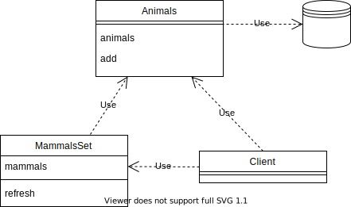

# TDD as a Design Tool
Imagine a hypothetical problem where we want to create an application that can easily print a list
of all different species of mammals that we have stored in a database. In essence we want to
create a class that we can use as some kind of cache. We call this class `MammalsSet`. In our
database we have a lot of data about many different animals. The database contain individuals, i.e.,
there can be many animals of the same species. The client can be used to add new animals to the
database and the idea is that we can send a message to the `MammalsSet` to refresh its list over
different mammals species. If we send a message to the `MammalsSet` to retrieve all mammals
we will get a list that contains all different species of mammals. Below is an overview picture
of the relation between the different classes.

## Scope
In this text we will experiment with Test Driven Development (TDD) and see if it can be used
to help the design process. The implementation will be done in Python using the builtin unittest
framework and mocking support. The idea is to address the problem in a TDD fashion which means
that we will not write a single line of code if we don't have a failing test for it. We will use
the *Red-Green-Refactor* idea to improve the code. Each test case shall be small, following the
*Arrange, Act, Assert* pattern.

During the process, the scope of the application will be changed. We will add new requirements,
change some ideas, refactor the code, etc. The diagram above shall be seen as starting point and
a base for our work. The diagram will be updated to follow the development. 

Let's jump right into it with a first test.

## First Test
* Create a unittest file `test_mammals.py`
* Create a test case that creates an object of the class `MammalsSet`. Name it `init`.
  Run the test and watch if fail.
* Create a python file `mammals.py` and a class named `MammalsSet`. Implement using a
  simple `pass`. Import the class from the unittest, run the test again and watch it succeed.
* Rename the testcase to `test_return_empty_list_if_no_mammals`. We have no actual need for
  the `init` test case, it is too simple. Instead, we extend the testcase to be as simple as
  possible, but still have a meaning. Check that the the length of the attribute `mammals` is 0.
  It is a very simple test, but is useful for at least two reasons.
  1. It defines the interface to the `MammalsSet` class by defining the name of an attribute
     or method, including its return value.
  1. It defines how the class shall behave when there are no mammals.

  This test case might seem too trivial but the purpose of it is to use it to drive the design
  and to get the implementation started. Run the test case. It will fail since the `MammalsSet`
  class does not have a `mammals` attribute.
* Add a `mammals` attribute and set it to an empty list. We could make it a `set()` but we
  don't know now if that is the best way to implement it. So let's wait with that. Run the test,
  it shall now work.

The first part of the implementation is now finished.

## Second Test
With the first test case done, what would be a good next step? A natural thing would be to add
some mammals to the list. But how do we do that? If we consult our draft overview design, we see
that we have planned for a `refresh` message that the client can send to the `MammalsSet`
object. Let's write a test for that. If we send a `refresh` message, what should happen? In the
first test case we had a query to the object and we got a list in return. In this case, we want
something to happen; a command. A command typically has side effects and we need to define those
side effects and also write a test to check that it happens.

In the draft design, we have envisioned a database that contains all animals that we know of. A
natural effect of that `refresh` command message is sente to the `MammalsSet` object could be
that a new message is sent from the `MammalSet` object to the database. Since we have no
database implementation database yet, we are free to define the interface. In order to write the
test, we need to do this but we also need to understand the relationship between the `MammalSet`
object and the database and the life cycle. We assume that the database will exist before the
`MammalSet` object. The simplest thing to do right now is to give the database as an input
argument when the `MammalSet` object is created and send messages to that instance. Let's
assume that we have an `Animals` class with an `animals`method. The simplest test case that
we can the write is to check that an `animals` message is sent to the `Animals` instance if
the `refresh` message is sent to a `MammalsSet` object.

* Create a new test case `test_refresh_generates_call_to_database`. In that test case, do the
 following:
  1. Create a mock database
  1. Create an instance of a `MammalsSet` and provide the mock database as input

There is builtin support for mocks in the Python unittest module. Simply import unittest.mock and
create an instance of the Mock class.

* Run the test case and watch it fail.
* Make the minimal change to make it pass. In this example, we add a parameter to the init
  function of the `MammalsSet` class. Store a reference to the database in an instance variable.
* Add the following to the test case:
  1. Send the `refresh` message to the `MammalsSet` instance (i.e., call the `refresh` method)
* Run the test case and watch it fail.
* Add the `refresh` method to the `MammalsSet` class. Implement it with `pass`
* Finalize the test case with an assert that the `animals` message is sent to the mock database.
* Run the test case and watch it fail.
* Implement the `refresh` function with a call to the database's `animals` method. The test now
  passes.

The second test case is now complete and we have a working implementation that fulfils all
(!) the tests in our suite. Maybe not very impressive at the moment but we have made a few important
design decisions on the way and we have documented them in working code. Let's head for the next
test.

## Third Test
It is now time to actually add something to the `MammalsSet `. Since we do that by responding to
the request message sent to the database, we need to control the response to the command that we
sent in the previous test. The Mocks can easily be changed to do that. but the question is what to
return. The easiest is probably to return a list of all the animals in the database. And the
simplest test would be to have an empty database and return an empty list. The problem with such a
test, though, is that it would not fail and it would not trigger us to write any new production
code. It seems that we need to make some more design decisions before we can continue. If we decide
how to represent the animals in the list that is returned from the database we would be able to
have one animal in the database. To make that animal also part of the `MammalsSet`, we need also to
make that animal a mammal. If we represent the return value from the `animals` method call as a list
of objects of an `Animal` class, we could create a new test case that would open up for the next
step. Let's do that.

Create a new test case called `test_return_list_with_one_item_if_database_contains_one_mammal`.
* Create an instance `MammalsSet` instance with a mock as an argument.
* Call the `refresh` method on the `MammalsSet` instance.
* Check that the length of the `mammals` attribute on the `MammalsSet` instance is 1.
* Run the test and watch it fail.

We now need to take control of the database mock to return a list containing one mammal. One way of
doing that is to create a new class that inherits the Mock class. We can then add our own methods
and attributes to this class to control its behavior.

* Create a new class called `DatabaseMock`. Add a method to the mock called `animals`. Let the
  method return a list that contains an object that we can interpret an a mammal. When the
  implementation progress, we might need to be more specific, but we keep it simple for now and
  just create a Mock object that we put in the list.
* Create an instance of the `DatabaseMock` class in the test case and use this instance as
  argument to the mammals_set.
* The test case is now ready and running it shows that it fails.

We can now turn to the implementation. The idea is to update the refresh method on the `MammalsSet`
class to store the returned list of animals in the `mammals` list. We actually don't care right
now whether the returned animal is actually a mammal. We will need to elaborate on this soon.

* To implement the refresh method, we iterate over the list of all items returned by the call to
  the `animals` method on the database instance and add those items to the mammals list.

If we now run the tests again, we see that the test will pass. Unfortunately, our second test
now fails. This is due to that the mock that we provided earlier on does not support the new actions
that we now do in the `refresh` method. The test case helped us in the earlier steps of the design,
but now it is no longer needed. Let's remove it.
